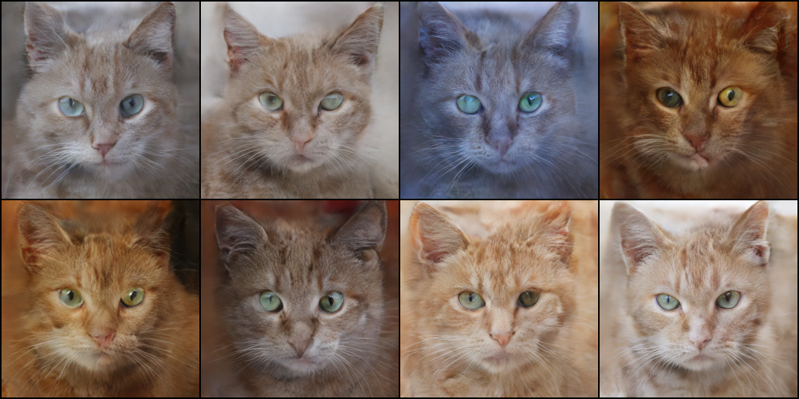
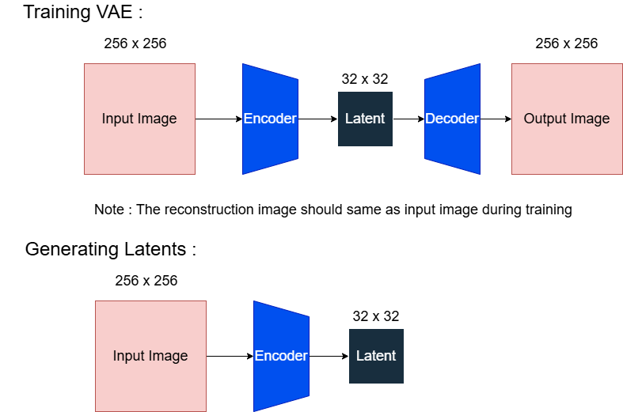
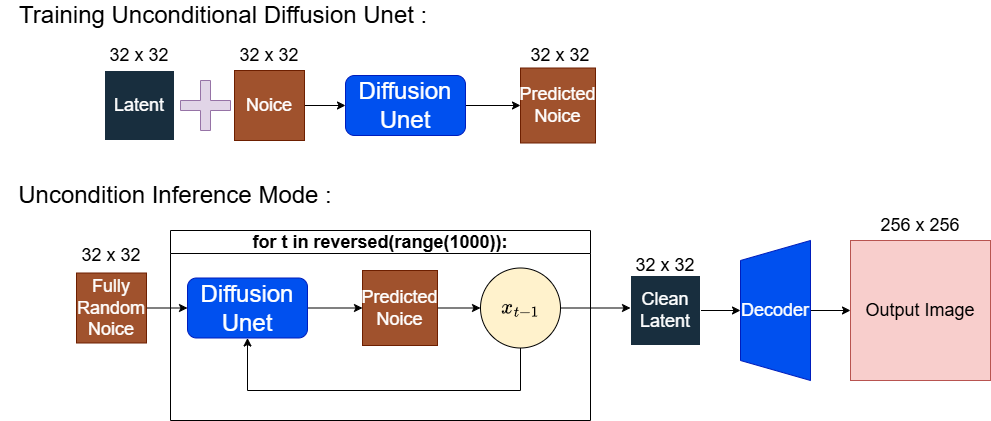
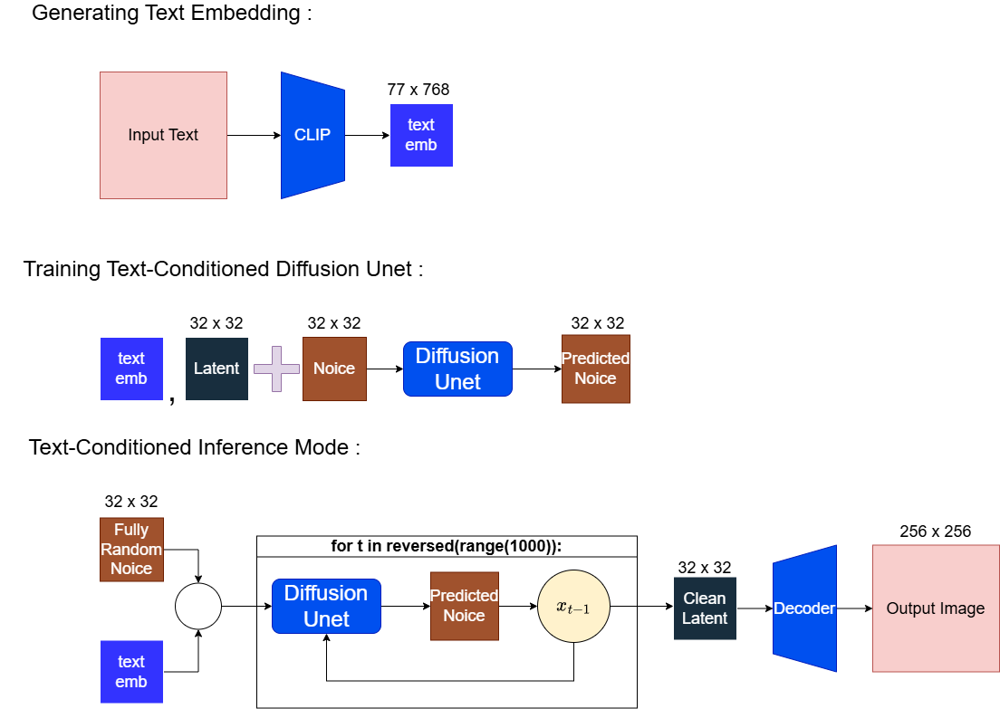
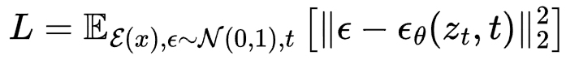
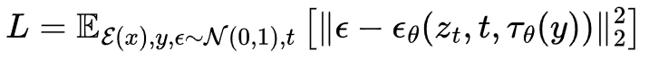

# Latent Diffusion From Scratch: Unconditional and Text-to-Image (T2I) Generation.

|||
| :---: | :---: |
| **Unconditional Image Generation** | **Prompt : A cute orange cat with green eyes** |

## Architecture Overview
There is 3 models to be trained , Variational AutoEncoders (VAE) , Unconditional Diffusion U-Net and Text-Conditioned Diffusion U-Net.

- Both Diffusion U-Net use the same VAE during inference mode.
- Animal faces dataset (AFHQv2 512×512) was used in this training.
- Image Captioning was produced from Florence-2.
- Text Embedding was produced from CLIP Embedding.



### VAE Training Loss

The VAE is trained using a composite loss function that combines pixel-level accuracy, perceptual similarity, and latent space regularization:

$$L_{VAE} = \lambda_{LPIPS} \mathcal{L}_{LPIPS} + \lambda_{KL} D_{KL}(q(z|x) \| p(z)) + \mathcal{L}_1 + \lambda_{adapt} \mathcal{L}_{GAN}$$

**Where:**
* **$\mathcal{L}_{LPIPS}$**: Perceptual loss (Learned Perceptual Image Patch Similarity).
* **$D_{KL}$**: Kullback–Leibler divergence to regularize the latent space.
* **$\mathcal{L}_1$**: Mean Absolute Error (MAE) for pixel-wise reconstruction.
* **$\mathcal{L}_{GAN}$**: Adversarial loss from the discriminator to improve image sharpness.
* **$\lambda$**: Weighting factors for each loss component.
*(Note: GAN Loss will dominate if not handle properly, luckily didn't happen in first time VAE training, but it does for my second try)*

| **Unconditional** | **Text-Conditioned** |
| :---: | :---: |
|  |  |
|  |  |

## More Details Architecture Explanation
Need flowchart for clearer explanation ?
[**Click here to browse the architecture flowcharts**](FlowChart/)

I have provided the source file for anyone who wants to study the architecture deeply or modify the diagrams.


* **[Download Source File (.drawio)](FlowChart.drawio)**
  
*(Note: To open this file, go to [app.diagrams.net](https://app.diagrams.net/) in your browser and drag-and-drop the file onto the canvas.)*

To view my draft and notes when studying Latent Diffusion :

[View the Draft and Notes](https://1drv.ms/o/c/eae736d6f2d45eed/IgAV2N1tMUu1QaddKr_KNX88AeZ-4xvzktsisAO-h5fDtRE?e=DPCh6h)

*(Note: The codes wrote inside notes might be differ with the actual implementing codes)*


## Codes Implementation
For Training VAE + Unconditional Diffusion-UNet:
[](https://colab.research.google.com/github/Yang-star-source/Latent_Diffusion_From_Scratch/blob/main/Latent_Diffusion_From_Scratch.ipynb)

For Unconditional Image Generation Inference Mode (One Click Run):
[](https://colab.research.google.com/github/Yang-star-source/Latent_Diffusion_From_Scratch/blob/main/Latent_Diffusion_From_Scratch_Inference.ipynb)

For Training Text-Conditioned Diffusion-UNet:
[](https://colab.research.google.com/github/Yang-star-source/Latent_Diffusion_From_Scratch/blob/main/LDM_T2I_Training.ipynb)

For Text-Conditioned Image Generation Inference Mode (One Click Run):
[](https://colab.research.google.com/github/Yang-star-source/Latent_Diffusion_From_Scratch/blob/main/LDM_T2I_Inference.ipynb)


## Dataset 
```bibtex
@inproceedings{choi2020starganv2,
  title={StarGAN v2: Diverse Image Synthesis for Multiple Domains},
  author={Yunjey Choi and Youngjung Uh and Jaejun Yoo and Jung-Woo Ha},
  booktitle={Proceedings of the IEEE Conference on Computer Vision and Pattern Recognition},
  year={2020}
}
```

```bibtex
@article{xiao2023florence,
  title={Florence-2: Advancing a unified representation for a variety of vision tasks},
  author={Xiao, Bin and Wu, Haiping and Xu, Weijian and Dai, Xiyang and Hu, Houdong and Lu, Yumao and Zeng, Michael and Liu, Ce and Yuan, Lu},
  journal={arXiv preprint arXiv:2311.06242},
  year={2023}
}
```

[Dataset from Kaggle](https://www.kaggle.com/datasets/andrewmvd/animal-faces)

[CATS ONLY used in this training](https://huggingface.co/datasets/ziyang06315/cats_images_dataset/tree/main)

*(Note: Training dataset only use 5558 cat images)*

## Study Resources

### Papers
* **Denoising Diffusion Probabilistic Models** - [Ho et al. (2020)](https://arxiv.org/abs/2006.11239)
* **Attention Is All You Need** - [Vaswani et al. (2017)](https://arxiv.org/abs/1706.03762)
* **High-Resolution Image Synthesis with Latent Diffusion Models** - [Rombach et al. (2021)](https://arxiv.org/abs/2112.10752)

### Articles
* **Diffusion Model from Scratch** - [Hugging Face](https://huggingface.co/learn/diffusion-course/unit1/3)
* **KL Divergence** - [GeeksforGeeks](https://www.geeksforgeeks.org/machine-learning/kullback-leibler-divergence/)
* **Florence-2 Tutorial** -[Hugging Face](https://huggingface.co/microsoft/Florence-2-large/blob/main/sample_inference.ipynb)
* **CLIP Embedding Documentation** -[Hugging Face](https://huggingface.co/docs/transformers/model_doc/clip)

### Videos
* [Diffusion Models: DDPM | Generative AI Animated](https://www.youtube.com/watch?v=EhndHhIvWWw) – Excellent visualization of the forward/reverse process.
* [The Key Equation Behind Probability](https://www.youtube.com/watch?v=KHVR587oW8I) (Artem Kirsanov) – Essential for understanding the entropy/KL-divergence math.
* [Attention in transformers, step-by-step](https://www.3blue1brown.com/lessons/attention) (3Blue1Brown) – Visual breakdown of the Attention Mechanism.

